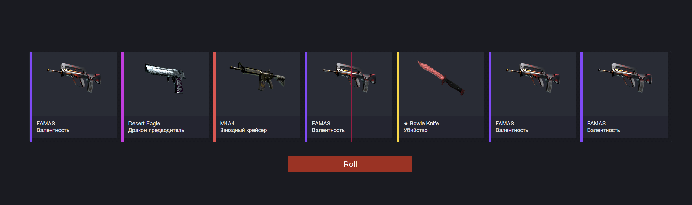

# CS:GO ROULETTE

Install script:
```shell
npm install
```

Start script:
```shell
npm start
```

## Additional information

+ Change weapons.json to add weapons to roulette.
+ The more you specify objects of the same weapon, the more often it will fall out
+ The weaponsCount variable is responsible for the number of blocks in roulette
+ The transitionDuration variable is responsible for the duration of the roulette scrolling
